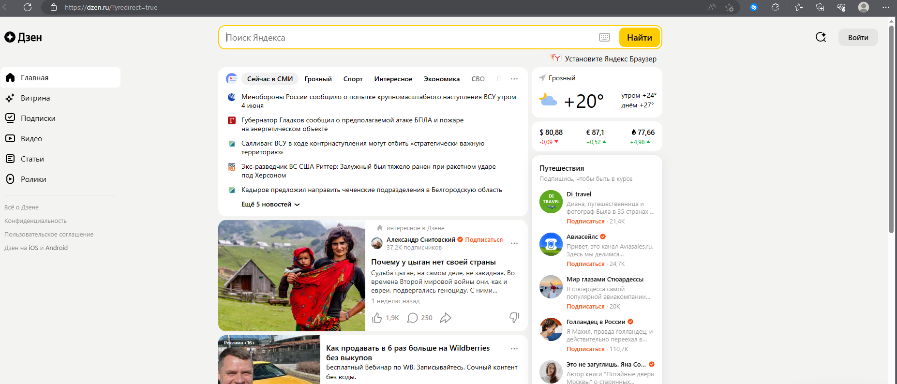
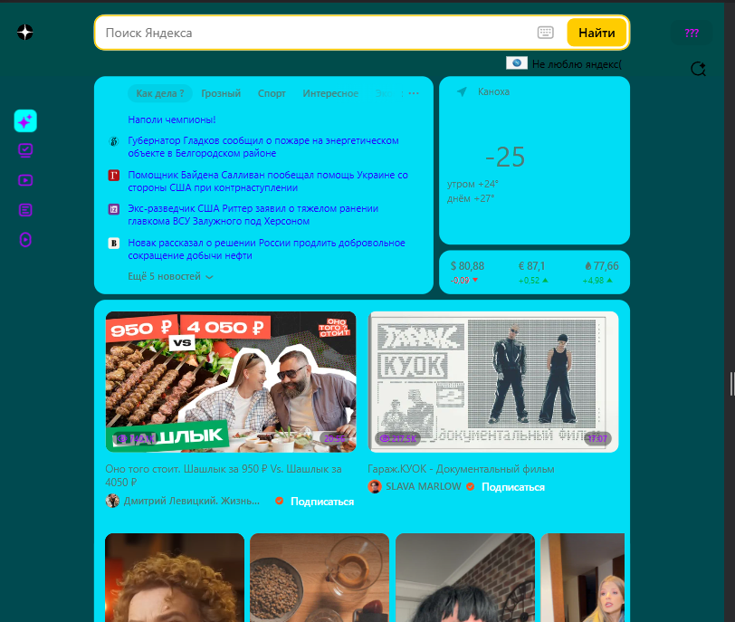
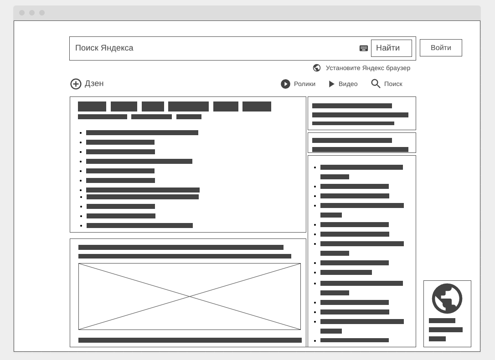

# Урок 1. Веб-технологии: вчера, сегодня, завтра
сдаем либо как md файл и через ваш гитхаб
либо как html страничка с набором доп файлов, сдавать как архив.

**Задача на основе сайта yandex.ru:**
1. Определите, на каком протоколе работает сайт.
    - 
    - 
2. Проанализируйте структуру страницы сайта.
    - Ссылка на сайт - yandex.ru
      В шапке сайта(Header) - поле для поиска, вход, предложение установить яндекс, поиск в дзене
      Ниже расположены блоки контента(Content) -  новости, погода, курсы валют, короткометражные видео и т.д. 
      Слева от контента расположен Сайдбар(Sidebar) в нем расположены - логотип дзена, переход на главную страницу, витрина, подписки, видео, статьи, ролики. 
      Справа тоже есть Сайдбар с предложением установить яндекс
      На сайте нет подвала(Footer)
3. Внесите не менее 10 изменений на страницу с помощью инструмента разработчика и представьте скриншоты было/стало.
     - 
     - 
4. Задание по желанию необязательное - Создайте прототип низкой детализации (дополнительное задание, если на семинаре дошли до задания №8).
     - 

